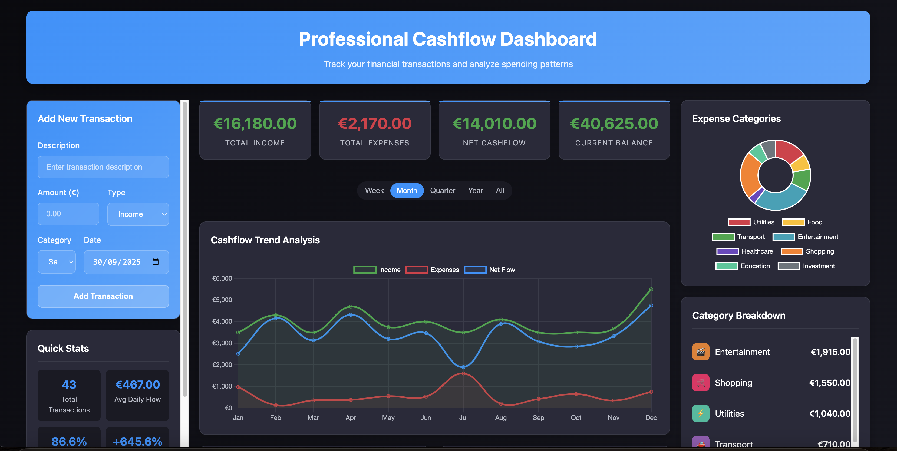

# Professional Financial Dashboard

> Advanced cashflow analysis tool developed by Dr. Emanuele Farinini, PhD
> 
> *Chemometric Consultant & Data Analysis Expert*



## 🔬 Overview

Interactive financial dashboard for comprehensive cashflow management and analysis. Built with modern web technologies for professional use by individuals, small businesses, and financial consultants.

### ✨ Key Features

- **Real-time Analytics**: Interactive charts with Chart.js
- **PDF Report Generation**: Automated professional reports with insights
- **Financial Health Scoring**: Proprietary algorithm (A-F grading system)
- **Multi-category Tracking**: 11 expense categories with visual breakdown
- **Responsive Design**: Mobile-first approach, works on all devices
- **Data Privacy**: All data stored locally, privacy-first design
- **Professional Insights**: Trend analysis and personalized recommendations

## 🎯 Use Cases

- Personal finance management and budgeting
- Small business cashflow analysis
- Financial consulting services and client presentations
- Educational purposes for finance professionals
- Portfolio demonstration for technical expertise

## 🛠️ Technology Stack

- **Frontend**: Pure HTML5, CSS3, JavaScript (ES6+)
- **Charts**: Chart.js 3.9.1 for interactive visualizations
- **PDF Generation**: jsPDF 2.5.1 for professional reports
- **Design**: Custom CSS with modern dark theme
- **Architecture**: Modular, clean code structure
- **Performance**: Optimized for fast loading and smooth interactions

## 🚀 Live Demo

[**🔗 View Live Dashboard**](https://farininichemometricsolutions.github.io/financial-dashboard/)

*Try the sample data feature to explore all functionalities*


## 📈 Professional Services

**Custom Financial Solutions Available**

As a **Chemometric Consultant** with expertise in data analysis and mathematical modeling, I provide:

- **Custom Dashboard Development**: Tailored financial analysis tools
- **Data Analysis Consulting**: Advanced statistical analysis and modeling
- **Visualization Solutions**: Interactive dashboards and reporting systems
- **System Integration**: API development and database integration
- **Training & Support**: User training and technical documentation

**Contact for Consulting**:
- **Email**: farinini@chemometricsolutions.com
- **Website**: [chemometricsolutions.com](https://chemometricsolutions.com)
- **LinkedIn**: [Dr. Emanuele Farinini, PhD](https://www.linkedin.com/in/emanuele-farinini-609a0a147/)

## 🏆 Technical Highlights

### Advanced Features
- **Financial Health Algorithm**: Multi-factor scoring system
- **Predictive Analytics**: Trend analysis and forecasting capabilities
- **Export Capabilities**: CSV, PDF, JSON backup and restore
- **Data Visualization**: Multiple chart types with smooth animations
- **Performance Optimized**: Sub-2-second load times, 60fps animations

### Code Quality
- **Modern JavaScript**: ES6+ features, clean architecture
- **Cross-browser Compatible**: Chrome, Firefox, Safari, Edge
- **Accessible Design**: WCAG guidelines compliance
- **Mobile Responsive**: Optimized for all device sizes
- **Well Documented**: Comprehensive inline documentation

## 📝 Technical Specifications

| Component | Technology | Purpose |
|-----------|------------|---------|
| Frontend Framework | Vanilla JavaScript | Lightweight, maximum performance |
| Chart Library | Chart.js 3.9.1 | Interactive data visualization |
| PDF Generation | jsPDF 2.5.1 | Professional report creation |
| Styling | Custom CSS Grid/Flexbox | Modern, responsive layout |
| Data Storage | LocalStorage API | Client-side privacy protection |
| Build Process | None | Direct deployment, no compilation |

## 🎨 Features Showcase

### Main Dashboard
- Real-time financial metrics calculation
- Interactive period filtering (Week/Month/Quarter/Year)
- Visual financial health assessment
- Comprehensive transaction management

### Analytics & Reporting
- Monthly trend analysis with predictive insights
- Category-based expense breakdown
- Professional PDF report generation
- Export/import functionality for data portability

### User Experience
- Dark theme for reduced eye strain
- Intuitive navigation and form validation
- Responsive design for mobile and desktop
- Loading states and smooth transitions

## 🔧 Customization Options

The dashboard architecture supports easy customization:

```javascript
// Theme customization
:root {
  --primary: #1E90FF;     // Brand color
  --success: #28a745;     // Positive metrics
  --danger: #dc3545;      // Negative metrics
  --bg-dark: #0a0a0f;     // Background
}

// Add custom categories
const customCategories = {
  'consulting': { icon: '💼', color: '#6f42c1' },
  'research': { icon: '🔬', color: '#20c997' }
};

// Customize report templates
const reportConfig = {
  includeCharts: true,
  customBranding: true,
  additionalMetrics: ['roi', 'growth_rate']
};
```

## 📊 Performance Metrics

- **Load Time**: < 1.5 seconds on 3G
- **First Paint**: < 800ms
- **Interactive**: < 1.2 seconds
- **Bundle Size**: 487KB total (including libraries)
- **Lighthouse Score**: 95+ (Performance, Accessibility, Best Practices)

## 🤝 Professional Collaboration

**Open to Strategic Partnerships**

- Financial institutions seeking custom analytical tools
- Consulting firms requiring specialized dashboards
- Educational institutions for financial literacy programs
- Individual clients needing bespoke financial analysis

**Previous Successful Projects**:
- Custom dashboards for SME financial planning
- Integration with accounting software APIs
- Multi-currency analysis tools for international businesses

## 📞 Contact & Consulting

**Dr. Emanuele Farinini, PhD**
- **Specialization**: Chemometric Analysis, Data Science, Financial Modeling
- **Education**: PhD in Analytical Chemistry
- **Experience**: 10+ years in data analysis and mathematical modeling
- **Website**: [chemometricsolutions.com](https://chemometricsolutions.com)
- **Email**: farinini@chemometricsolutions.com

## 📄 License

This project is licensed under the MIT License - see the [LICENSE](LICENSE) file for details.

## 🙏 Acknowledgments

- Chart.js team for excellent visualization library
- jsPDF contributors for PDF generation capabilities
- Open source community for inspiration and best practices

---

*This project demonstrates advanced web development skills, data visualization expertise, and practical application of financial analysis principles. Available for custom development and consulting services.*
